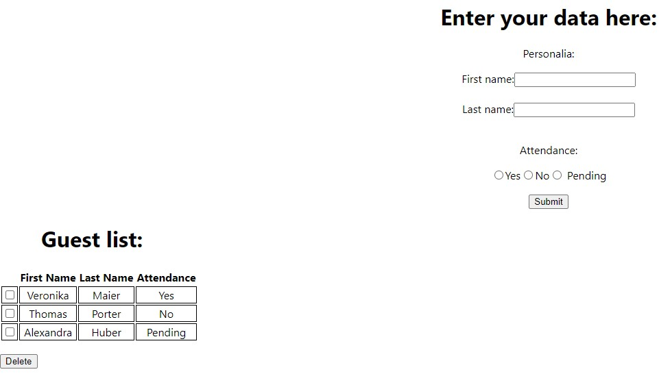

# react-guest-list-local

With this React application, it is easy to create a list of people, e.g. guests invited to an event. It is possible to enter first and last name as well as status of attendance, and add the guest to the guest list.

Please run `yarn start` to start the application.

## Links

[Online version of the app](https://github.com/hedi-far/react-guest-list-online)
